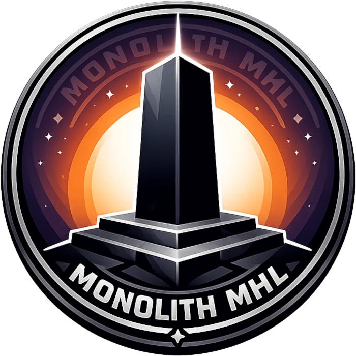

# Monolith MHL is a hub application for our Plasma 6 live wallpapers

Monolith MHL is a hub for beautiful animated live wallpapers for your Plasma 6 desktops.
Some of the (planned) features listed below:

## Features

- Multiple effects.
- **User created themes for the effects!**
- GPU accelerated animated wallpapers.
- Smooth color theme transitions.
- Layered processing pipeline for wider variety of effects.
- Plenty of adjustable knobs and parameters per effect
- Peformance aware tuning, speed controls and FPS capping.
- Optional configurable post-processing with lot of filters.

## Examples

The **Rainbow Waves** effect in action…

## Requirements

- KDE Plasma 6
- GPU with Vulkan 1.0+ or OpenGL ES 3.0+ support

## Installation

To install Monolith MHL wallpaper on your system press the right mouse button over your Plasma
desktop and select `Desktop and Wallpaper` from context menu. Next click `Get New Plugins…` and search
for `Monolith MHL` and then click `Install…`.

## Usage

By design, Monolith can (and will) feature multiple "effects" that can be used as your live
wallpaper. Said effects like "Rainbow Waves" or "Lava Lamp" are foundation of Monolith's,
however aside the main effects, Monolith also comes with post-processing filters, like color
correction, blur, chromatic aberration and more. And the order of filters in the pipeline
matters and affects the final result!

## Feedback

The Monolith MHL wallpaper hub is available on the [KDE Store](https://store.kde.org/p/2353773/).
Please do comment and rate it if you like the theme. Your feedback is appreciated!

Please do post your feature requests or issue reports
to [GitHub Issues](https://github.com/MarcinOrlowski/monolith-mhl/issues) page of the project.

## License

- Written and copyrighted ©2026 by Marcin Orlowski \<mail (#) MarcinOrlowski (.) com>
- Monolith MHL is open-source software licensed under
  the [MIT license](http://opensource.org/licenses/MIT)
