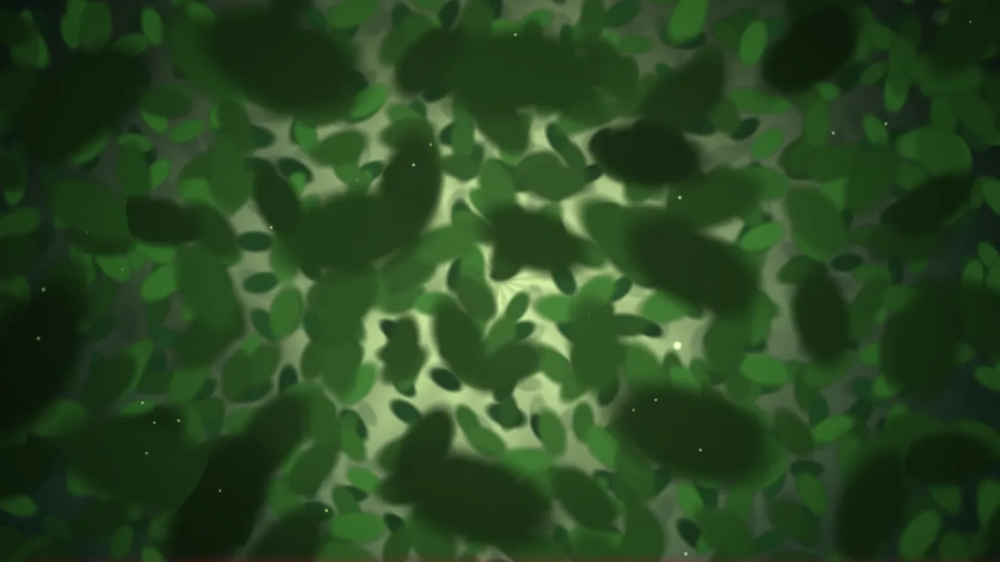
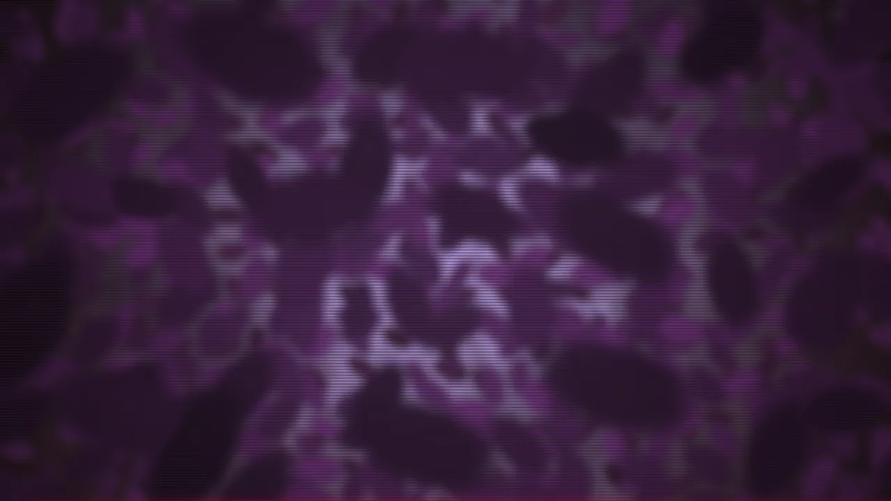
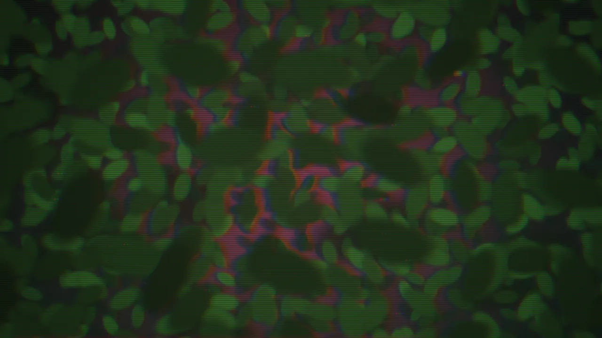

# Microscope Zoom

An endless, constant-speed forward zoom into a microscopic world. The "camera"
pushes straight in at a fixed rate — no drift or shake — while soft organic
shapes loom out of the central focal point, sweep past the edges and recycle, so
the motion never visibly resets. Floating dust motes drift past the lens. Every
shape position and shade is randomized, so the sample never repeats.

## Features

- Forward-only zoom at a fixed, adjustable pace (no camera shake).
- Layered "looming" shapes that fake depth for a real sense of pushing inward.
- Bundled microscopy-stain color themes (Chlorophyll, H&E, Gram, Fluorescence,
  Dark Field, Cyanotype, Amber) with optional auto-cycling and smooth cross-fades.
- Drop-in custom themes.
- Adjustable density.
- Living microbes with adjustable idle motion (wander, squirm, breathe).
- Optional slow scene rotation, either direction.
- Floating dust with independent amount and size controls.
- Scene toggles: depth fog, floating dust, and an edge vignette.
- Animation speed controls and FPS capping.
- Dimming control.
- Works with all post-processing filters.

## Gallery

Microscope Zoom effect on default settings, with no additional filters applied.

Microscope Zoom effect on default settings, with filters:
HUE Shift, Blur and Scanlines enabled.

Microscope Zoom effect on default settings, with filters:
RGB Offset and Scanlines enabled.

## Settings

### Theme

Colors come from themes (like the other effects) rather than manual pickers.
Each theme sets three colors: the specimen (cell), the background medium, and
the backlight illumination.

- **Initial theme** — pick a bundled theme, or **Random** to start on a random
  one each session.
- **Auto-cycle themes** — automatically switch themes on an interval (seconds or
  minutes).
- **Cycle in random order** — shuffle rather than cycling in list order.
- **Transition duration** — how long the color cross-fade between themes takes.

Themes can also be cycled from the desktop context menu (Next / Previous
Wallpaper Theme, Set Current Theme).

### Scene

- **Density** — how busy/full each looming sheet of cells is.
- **Microbe motion** — how lively the microbes are: the strength of their idle
  wander, squirm and breathing. 0% freezes them; higher is more active.
- **Rotation speed** — slowly spins the whole scene around the focal point. The
  magnitude sets the speed and the sign sets the direction (negative =
  counter-clockwise); 0 turns rotation off.
- **Depth fog** — hazes distant shapes into the background light for added depth.
- **Floating dust** — motes streaming past the lens.
  - **Dust amount** — how many motes are in the frame.
  - **Dust size** — how fine or coarse each mote is (lower = finer dust).
- **Vignette** — darkens the frame edges.

### Animation

- **Zoom speed** — forward push pace.
- **FPS cap** — limits the frame rate to save power.
- **Dim** — caps overall brightness.
