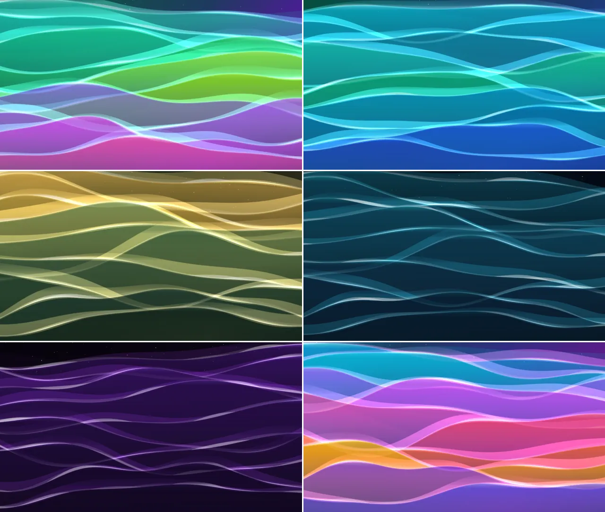

# Rainbow Waves

## Features

- User created themes supported!
- 20 built-in color themes.
- Smooth color theme transitions
- Adjustable wallpaper parameters.
- Animation speed controls and FPS capping.
- Configurable theme layers visibility.
- Post-processing filters (scanlines, chromatic aberration, color grading, hue shift, pixelate/mosaic).

## See also

- [How to create custom theme](theme.md)

## Gallery

