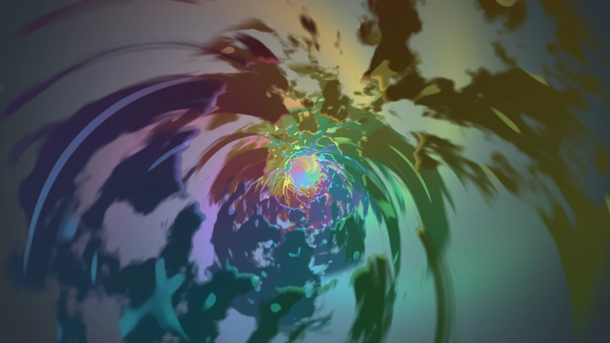

# Trippy Tunnel

An endless zoom into a psychedelic forest tunnel. Layered canopies of leaves recede toward a
glowing, swirling vortex at the centre while the camera flies forward at a constant pace - no
controls, it just keeps going. The whole tunnel slowly rotates while the central whirl
counter-rotates.

## Features

- Seamless infinite zoom

- Independent tunnel rotation and counter-rotating central vortex,

- Colour themes with the same auto-cycling and cross-fade machinery,

- 19 bundled themes grouped by tone:

  - Mixed/dark: Spectrum, natural Jungle, Neon, Ember, Abyss, Aurora, Gruvbox Dark, Gruvbox Light,
    Charcoal.
  - Psychedelic: Acid Trip, Vaporwave, Blotter, Plasma, Kaleidoscope, Ultraviolet, Toxic, Fever
    Dream, Oil Slick, Candy.

- Cycle themes from the desktop context menu (Next / Previous / Set Current Theme).

- Toggle each scene layer on or off

- Glowing "mushroom / flower" spots scattered across the canopy.

- Adjustable canopy density, swirl, depth haze and centre-glow brightness.

- Zoom-speed control and FPS capping.

- Dimming control.

Everything is generated procedurally in the shader - there are no image assets.

## Settings

### Layers

Every layer is grouped into its own section with a **Visible** toggle plus its settings. Layers that
depend on another (glow spots sit on the canopy) are disabled when their parent is off.

- **Canopy** - the leafy tunnel: density, **depth** (how sharply the rings recede toward the centre -
  higher makes a deeper tunnel), **tunnel swirl** (how tightly it twists), **tunnel width** (how far
  the canopy sits from the centre - higher opens a wider tunnel mouth), **centre hole** (radius of
  the clear opening at the centre where the canopy stops and the vortex shows through), **depth
  haze**
  (how far rings dissolve into the central glow) and **opacity** to fade the whole canopy.

  - **Auto-swirl** - drifts the tunnel swirl continuously at the chosen **speed** (small smooth
    steps; `0` = off).
  - **Swirl burst** - an independent toggle that jolts the swirl by **±margin**; it is *rolled*
    **every** N seconds and only fires with the given **probability**, so a 1 s interval at 10 %
    bursts only occasionally.
  - **Oscillate hole** - same roll (**±range every** N s at a **probability**)
    applied to the **centre hole**, but the range is measured from the *initial*
    Centre hole value (clamped 0–100 %), so it stays bounded and never creeps down to zero.
  - **Oscillate width** - the same bounded roll applied to the **tunnel width**.

  Each burst/oscillation picks a *uniform random* value in ±range (so it can land anywhere in that
  band, not just the extremes).

  Every swirl change - manual, drift or burst - is spring-smoothed so the rotation it induces eases
  gently in and out instead of snapping.

- **Glow spots** - brightness/quantity of the emissive mushroom-like spots on the canopy.

- **Centre glow (vortex)** - brightness, **vortex swirl** (how tightly the central background
  whirlpool winds, independent of the tunnel), **opacity** to fade the vortex, and a **centre
  bloom** - a soft, bright, semi-transparent glow over the middle (with adjustable **radius**) that
  hides the point where the swirl, stars and beams would otherwise converge.

- **Stars (points)**, **Beams (hyperspace)**, **Dots (twinkling stars)** - three space layers flying
  outward, each with **count** (absolute number; for beams the number of radial lines), **speed**
  (never jumps when changed), **length**
  (stars & beams; dots are plain round points), and **opacity** to blend the layer independently.
  All three fade out around the centre.

The space layers are coloured from the **active theme's palette**, so every set (spectrum, gruvbox,
psychedelic, and so on) tints them; a psychedelic set fans the beams out into a full rainbow.

### Theme

- **Initial theme** - the theme loaded at start, or *Random*.
- **Auto-cycle themes** - cross-fade to another theme every N secs/mins.
- **Cycle in random order** - shuffle instead of going in list order.
- **Cycle set** - restrict cycling/random selection to *All*, *Light*, *Dark*, *Mixed* or
  *Psychedelic* themes.
- **Transition duration** - how long each cross-fade takes.
- **Brightness** - globally darken the effect.

### Animation

- **Zoom speed** - how fast the camera flies into the tunnel.
- **Tunnel rotation** - signed spin speed of the whole tunnel (negative reverses direction).
- **Vortex rotation** - signed spin speed of the central whirl; defaults to the opposite direction
  of the tunnel.
- **Value transition** - how long a changed value (swirl, hole, width, opacities, …) takes to ease
  to its new setting.
- **FPS cap** - limit the animation frame rate to save power.

## Custom themes

Drop a `.qml` theme file into
`~/.config/monolith/trippy-tunnel/themes.d/` and restart plasmashell. See
`themes/example.qml` in the effect directory for the format - a theme provides
`canopy`, `glow` and `mist` colours, an optional `stars` colour and `mode`
tone (`light`/`dark`/`mixed`/`psychedelic`), plus a 6-colour `palette` that is wrapped around the
tunnel to drive the colour flow.

## Gallery

Trippy Tunnel effect on the default *Spectrum* theme, with no additional filters applied.

