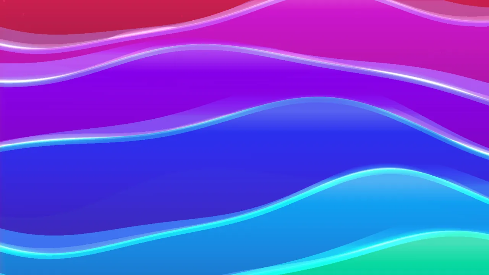
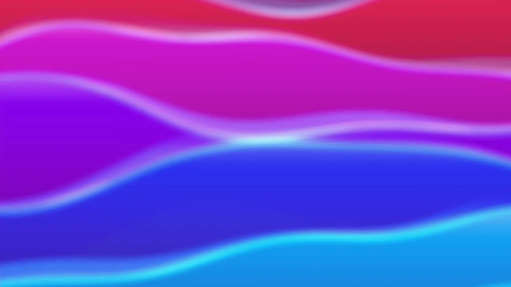

← [Back to documentation index](../../README.md)

# Blur

Softens the wallpaper by averaging each pixel with its neighbours. Useful for a
dreamy / out-of-focus look, or to attenuate busy backgrounds so icons and widgets
stand out. The larger the radius, the more smeared the result — at high values
individual shapes are reduced to blobs of color.

## Gallery

No filters:

With blur set to `6 px`

## Parameters

| Parameter | Description                                                                     | Default | Range     |
| --------- | ------------------------------------------------------------------------------- | ------- | --------- |
| Radius    | Blur kernel radius in pixels. Larger values soften more but cost more GPU time. | `8 px`  | `2–30 px` |

## Notes

- At `radius = 2` the effect is subtle; most users will want `8` or higher for a
  visible wallpaper-level softening.

## See also

- [Gaussian blur](https://en.wikipedia.org/wiki/Gaussian_blur)
