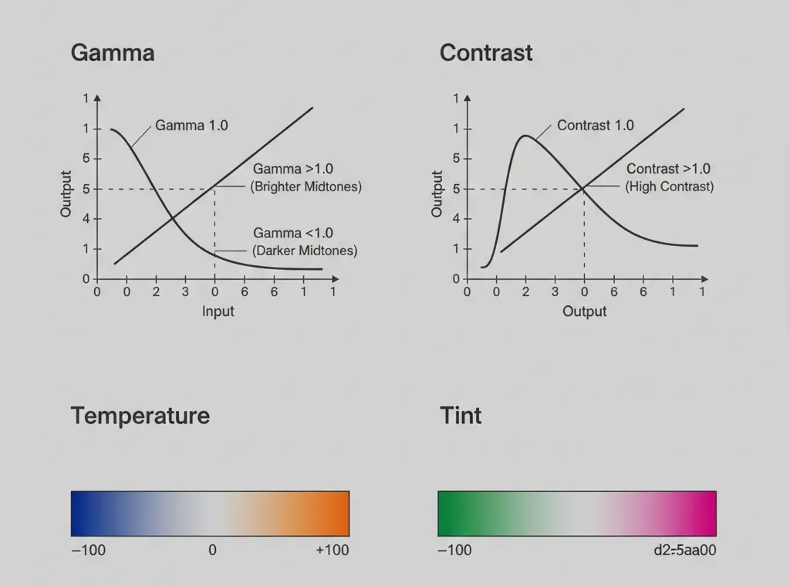

← [Back to documentation index](../../README.md)

# Color Grading

Photo-style tonal adjustments applied after the wallpaper is rendered. Lets you
brighten or darken midtones, push contrast, and warm or cool the overall
palette without touching the underlying effect's colors.

## Parameters

| Parameter   | Description                                                                  | Default | Range          |
| ----------- | ---------------------------------------------------------------------------- | ------- | -------------- |
| Gamma       | Midtone lightness. Below `1.0` darkens midtones, above `1.0` brightens them. | `1.0`   | `0.5–2.0`      |
| Contrast    | Spread between darks and lights around middle gray. `1.0` is unchanged.      | `1.0`   | `0.5–2.0`      |
| Temperature | Warm/cool shift. Positive pushes toward orange, negative toward blue.        | `0`     | `-100 to +100` |
| Tint        | Green/magenta shift. Positive pushes toward magenta, negative toward green.  | `0`     | `-100 to +100` |

## Notes

- Temperature and tint are independent axes — combine them to mimic specific
  lighting conditions (e.g. high temperature + slight negative tint for a golden
  hour look).

<!-- markdownlint-disable MD013 -->

<!--
Prompt to feed to a drawing agent to produce `img/grading-axes.webp`:

A 2×2 grid of small diagrams on neutral mid-gray background, each cell ~500×300 with its title above: (1) "Gamma" — a graph with x=input, y=output, showing three curves: straight diagonal (1.0), bowed upward (>1.0, brighter midtones), bowed downward (<1.0, darker midtones), labeled. (2) "Contrast" — same axes, three curves through midpoint (0.5, 0.5): diagonal (1.0), steep S-curve (>1.0), flat slope (<1.0). (3) "Temperature" — a horizontal gradient bar from blue (#3a6db5, left, "-100") through neutral (center, "0") to warm orange (#d98a2b, right, "+100"). (4) "Tint" — horizontal gradient bar from green (#4daa5a, "-100") through neutral ("0") to magenta (#c55aa0, "+100"). Labels in dark-gray sans-serif. No photography, flat vector schematic, 16:9 overall, transparent background. Output WEBP 1200×600.
-->

<!-- markdownlint-enable MD013 -->
