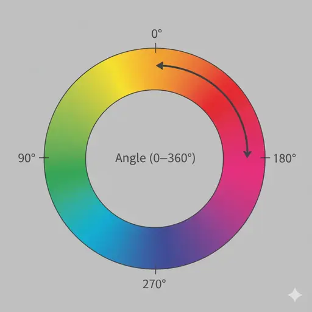

← [Back to documentation index](../../README.md)

# Hue Shift

Rotates every color on screen around the color wheel by a fixed angle. Reds
become oranges become yellows, and so on, while brightness and saturation stay
untouched. Useful for recoloring a favorite effect without editing its theme.

## Parameters

| Parameter | Description                                                                                                        | Default | Range    |
| --------- | ------------------------------------------------------------------------------------------------------------------ | ------- | -------- |
| Angle     | Rotation around the hue wheel. `0°` and `360°` leave colors unchanged; `180°` swaps every color with its opposite. | `180°`  | `0–360°` |

## See also

- [HSL and HSV color model](https://en.wikipedia.org/wiki/HSL_and_HSV)

<!-- markdownlint-disable MD013 -->

<!--
Prompt to feed to a drawing agent to produce `img/hue-wheel.webp`:

Flat schematic of a full HSV hue color wheel on a neutral mid-gray background. The wheel is a ring (donut, ~70% inner radius), fully saturated hues blending continuously (red at 0°, yellow at 60°, green at 120°, cyan at 180°, blue at 240°, magenta at 300°). Overlay a thin dark-gray curved arrow starting at 0° and sweeping clockwise ~180°, labeled "Angle (0–360°)". Mark 0°, 90°, 180°, 270° around the outside with small tick marks and numeric labels. No photography, flat vector schematic, 16:9, transparent background, labels in dark-gray sans-serif. Output WEBP 1200×600.
-->

<!-- markdownlint-enable MD013 -->
