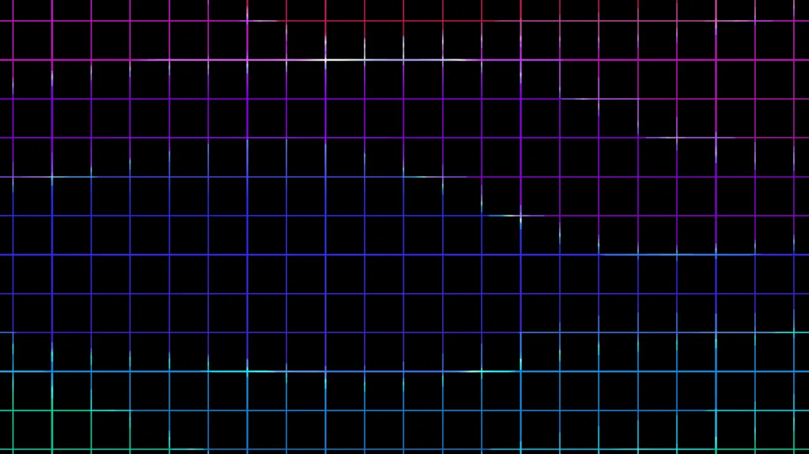
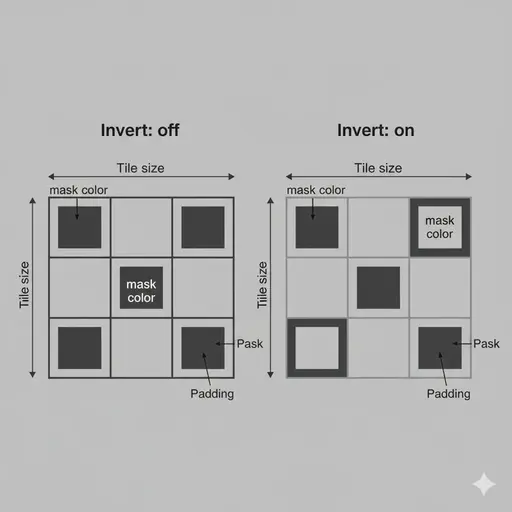

← [Back to documentation index](../../README.md)

# Mask

Tiles a square stencil across the wallpaper and replaces pixels either inside
or outside each tile with a solid color. Useful for perforated overlays, grid
patterns, pixel-art-style windows, or simple color-block frames.

## Gallery

With mask set to square, tile size 64 px, padding 1 px, mask color `#000000` (black).

## Parameters

| Parameter    | Description                                                                                                                               | Default   | Range                |
| ------------ | ----------------------------------------------------------------------------------------------------------------------------------------- | --------- | -------------------- |
| Tile size    | Side length of each repeating tile, in pixels.                                                                                            | `64 px`   | `4–500 px`           |
| Padding      | Empty gap inside each tile. Pixels within `padding` of the tile edge are considered "outside" the square. Must be smaller than tile size. | `8 px`    | `0 to (tile − 1) px` |
| Invert       | Which side of the square is treated as the "mask" region. Off = inside the square; On = outside (the padding area).                       | `off`     | on / off             |
| Mask color   | Color blended over the two regions.                                                                                                       | `#000000` | any hex color        |
| Mask opacity | How strongly the mask color covers the mask region. 0% = region is fully transparent; 100% = region is fully replaced by the mask color.  | `100%`    | `0–100%`             |
| Gap opacity  | How strongly the mask color covers the gap region. 0% = region is fully transparent; 100% = region is fully replaced by the mask color.   | `0%`      | `0–100%`             |

## Notes

- With the defaults (mask opacity 100%, gap opacity 0%), the mask region is a
  solid color and the gap shows the underlying wallpaper — the classic
  hard-edged stencil look.
- Lower the mask opacity to let the underlying wallpaper bleed through the
  colored region, or raise the gap opacity to tint the gap.
- For a clean grid effect, set padding small relative to tile size; for a
  "looking through a window" look, invert the mask so only the padding area
  shows through, or equivalently swap the two opacity values.

<!-- markdownlint-disable MD013 -->

<!--
Prompt to feed to a drawing agent to produce `img/mask-anatomy.webp`:

Two side-by-side diagrams on neutral mid-gray background, each showing a 3×3 grid of square tiles. Left diagram labeled "Invert: off": each tile has a solid dark fill inside (the square) with a lighter padding gap around it — the dark center is labeled "mask color" and an annotation arrow labels "Tile size" across the edge of one tile, another labels "Padding" across the gap. Right diagram labeled "Invert: on": inverted — the padding gap region is filled with the mask color, tile centers are the underlying (mid-gray) wallpaper, same annotations. No photography, flat vector schematic, 16:9 overall, transparent background, labels in dark-gray sans-serif. Output WEBP 1200×600.
-->

<!-- markdownlint-enable MD013 -->
