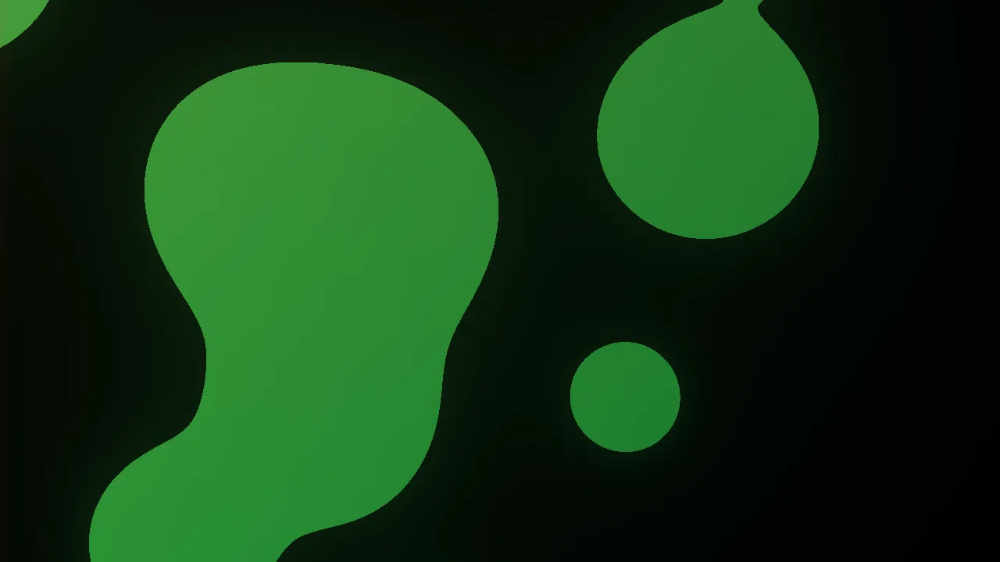
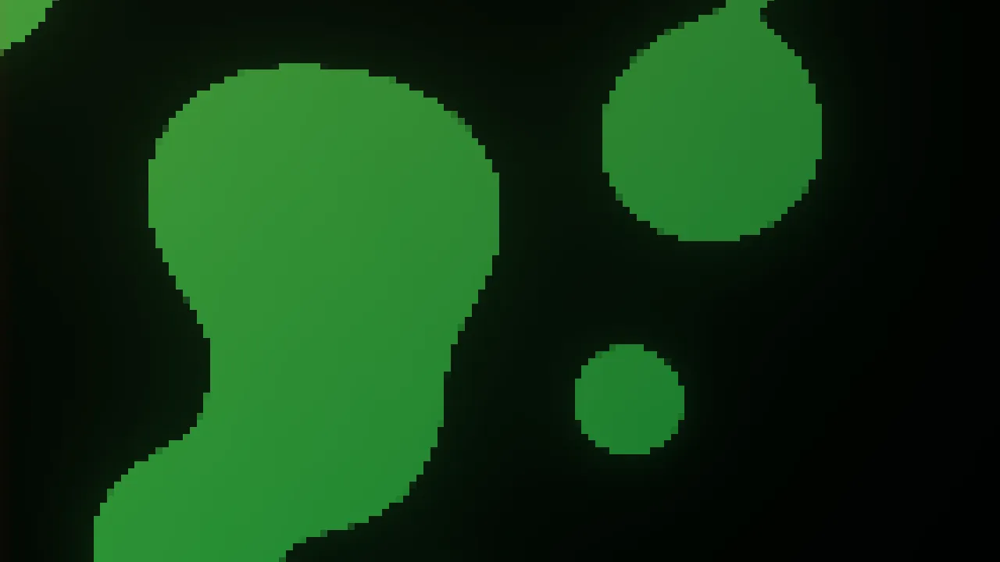

← [Back to documentation index](../../README.md)

# Pixelate

Reduces the wallpaper to coarse blocks of a single color each, producing a
mosaic / low-resolution look. Larger blocks erase finer detail and give a
chunky, pixel-art feel.

## Gallery

No filter

With blur set to `8 px`

## Parameters

| Parameter  | Description                                        | Default | Range     |
| ---------- | -------------------------------------------------- | ------- | --------- |
| Block size | Side length of each pixel block, in screen pixels. | `8 px`  | `2–64 px` |

## Notes

- Combine with Scanlines or CRT Curvature for an arcade-cabinet aesthetic.
