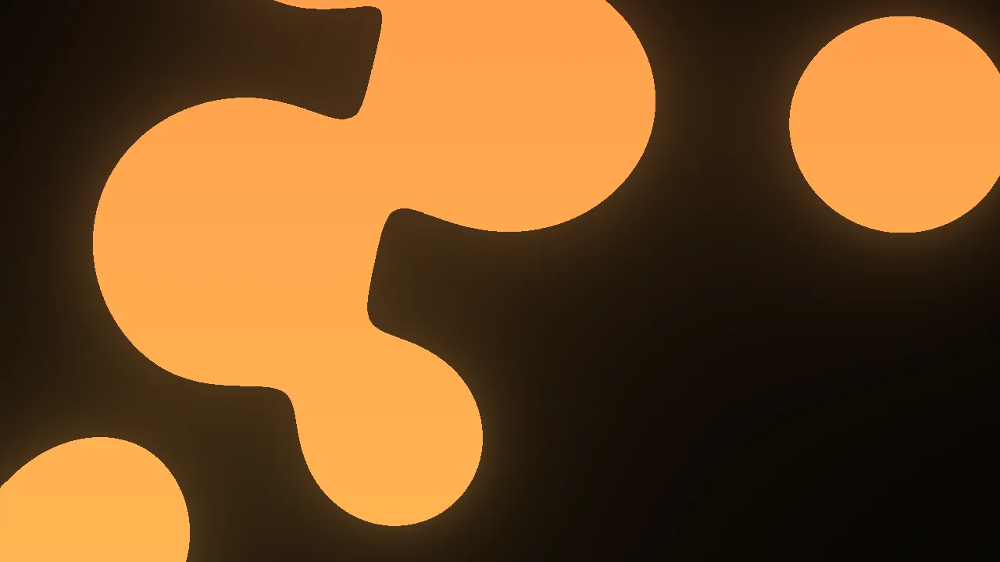
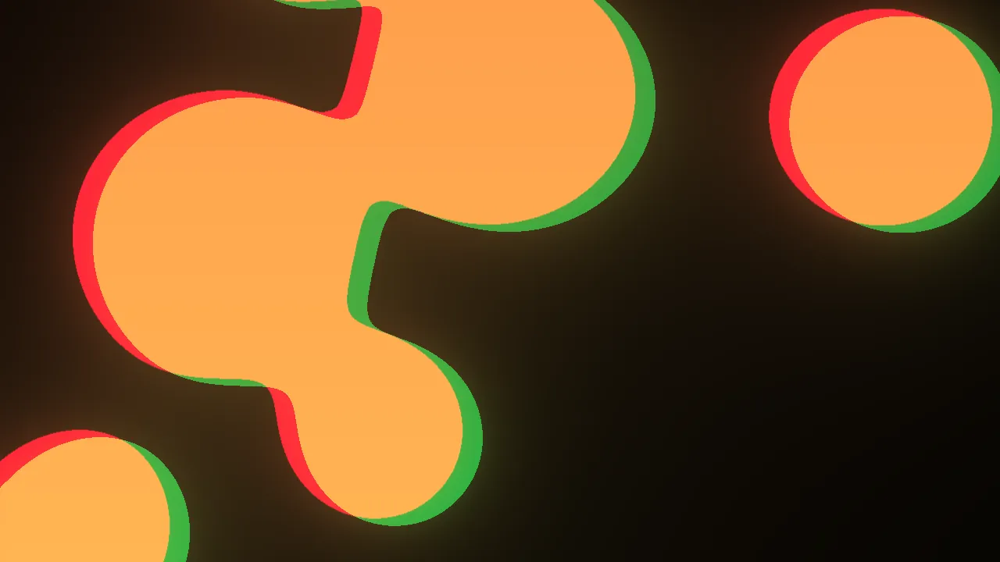
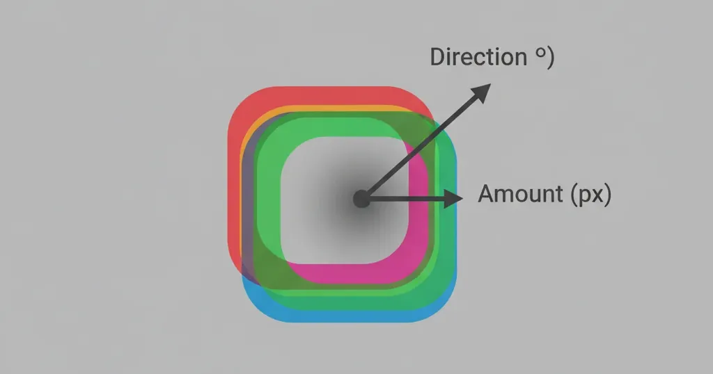

← [Back to documentation index](../../README.md)

# RGB Offset

Separates the red, green, and blue color channels and shifts them in a chosen
direction, producing a directional color-fringe / "glitch" or 3D-anaglyph look.
Similar to Chromatic Aberration but with a single fixed offset rather than a
radial one from the image center.

## Gallery

No filter.

With RGB offset set to `25 px` and direction to `20°`.

## Parameters

| Parameter | Description                                                                 | Default | Range      |
| --------- | --------------------------------------------------------------------------- | ------- | ---------- |
| Amount    | How far the channels are shifted apart, in pixels.                          | `5 px`  | `1–200 px` |
| Direction | Angle of the shift, in degrees. `0°` shifts horizontally; `90°` vertically. | `0°`    | `0–360°`   |

## Notes

- For a classic "broken VHS" look try `amount = 10–20 px` with the default
  horizontal direction.
- For a 3D-glasses effect, pair a small horizontal offset (`~5 px`) with a dark
  background.

<!-- markdownlint-disable MD013 -->

<!--
Prompt to feed to a drawing agent to produce `img/rgb-vector.webp`:

Flat schematic on neutral mid-gray background. Show three identical simple shapes (e.g. solid silhouettes of a rounded square) stacked with slight offsets: one pure red (#ff0000), one pure green (#00ff00), one pure blue (#0000ff), each shape about 50% opacity so overlap areas mix. The three shapes are displaced from a common center along a single vector drawn as a dark-gray arrow, labeled "Direction (°)". Annotate the distance between any two adjacent shape centers with a double-headed arrow labeled "Amount (px)". No photography, flat vector schematic, 16:9, transparent background, labels in dark-gray sans-serif. Output WEBP 1200×600.
-->

<!-- markdownlint-enable MD013 -->
