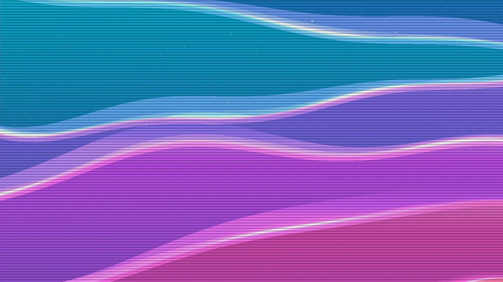

← [Back to documentation index](../../README.md)

# Scanlines

Overlays horizontal lines across the wallpaper to mimic the look of an old CRT
display. Line density, thickness, color and opacity are all adjustable, and
lines can be made to scroll slowly up or down for a subtle animated effect.

## Gallery

No filter.

With TV Scanlines configured as follow: intensity `30%`, frequency `1.0x`, thickness `1.0x`, scroll speed `0.5x`, color `#000000` (black), line opacity `20%`.

## Parameters

| Parameter    | Description                                                                                                                      | Default      | Range         |
| ------------ | -------------------------------------------------------------------------------------------------------------------------------- | ------------ | ------------- |
| Intensity    | How strongly the lines darken the image underneath. `0%` = invisible, `100%` = fully replace underlying pixels in the line area. | `50%`        | `0–100%`      |
| Frequency    | How tightly packed the lines are. Higher values = more, thinner-spaced lines.                                                    | `1.0x`       | `0.1–10.0x`   |
| Thickness    | Width of each individual line relative to the spacing between them.                                                              | `1.0x`       | `0.1–10.0x`   |
| Scroll speed | Vertical scrolling rate. `0` is static; positive scrolls down, negative scrolls up.                                              | `0` (static) | `-10.0–10.0x` |
| Line color   | Color of the lines themselves.                                                                                                   | `#000000`    | any hex color |
| Line opacity | Blend factor for the line color. `0%` falls back to simple darkening; higher values tint the lines toward the chosen color.      | `0%`         | `0–100%`      |

## Notes

- Pair with CRT Curvature for a complete retro-monitor look.
- A slow scroll speed (e.g. `1.0x`) combined with moderate intensity gives a
  subtle, living-screen feel without being distracting.
